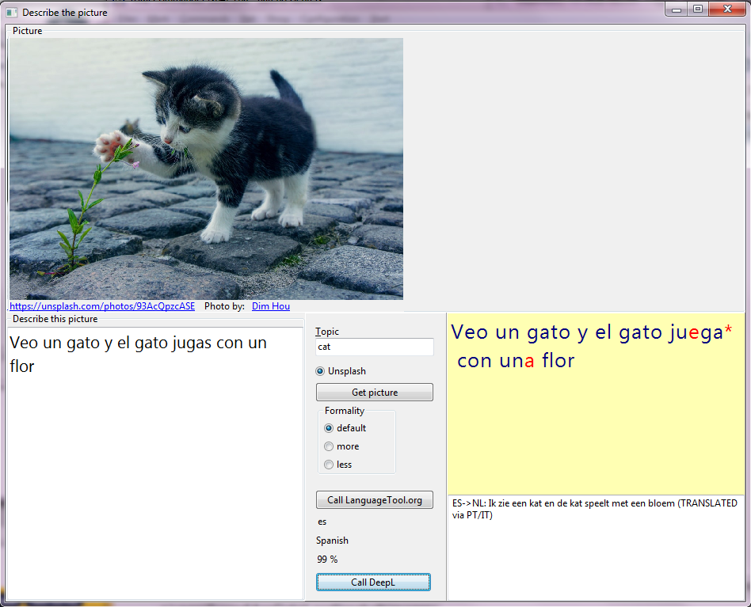
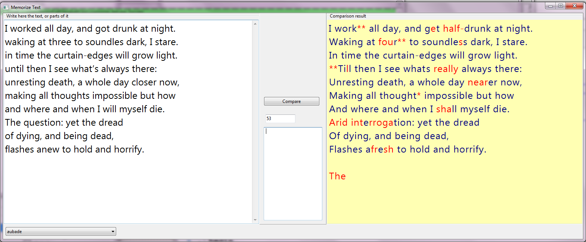
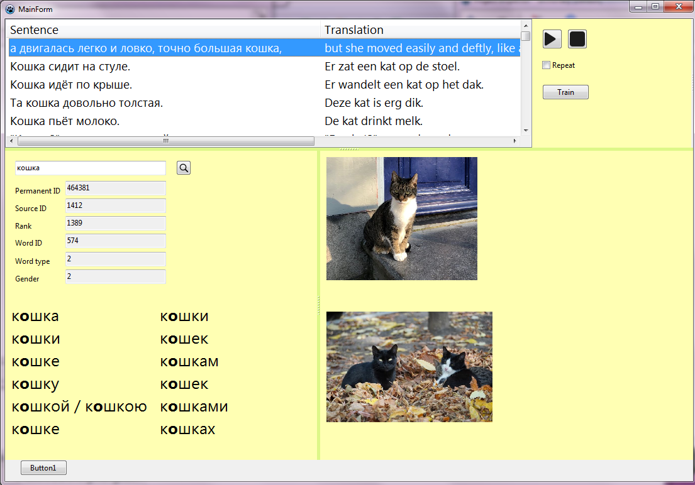

# langbath

## Tools for language immersion

This is a suite of Open Source tools for language immersion. It is targetted to learning Russian but should be
applicable in general.
The suite contains of several programs, with or without User Interface (UI). It's all written in Lazarus (Pascal).
Some of the units in folder **common** are also usable outside this context. They will
be listed below.

The suite contains the next programs:

## split_sentences
This is a **command line** tool. It splits a text file (usually exported from a PDF) into sentences.
Every line will contain one sentence. The purpose of this is to provide input for *assign_timings*.
That tool needs lines splitted into smaller pieces, sentences, or even shorter.
Therefore sentences can also be split at semi colons.

Usage is simple: first argument is the input text file, second argument is the output text file.

## assign_timings
This is a **User Interface** tool. It uses a (splitted) textfile in the target language (say: Russian).
And optionally also in the native language (say: English). Furthermore it needs an MP3 with
that same text in the target language. With this input it lets the user assign, for every sentence,
a **begin** and **end** time. The target of this is that a sentence can be played on its own.
And that is also what the tool can do: it can replay sentence by sentence. Also it can replay
sentences repetitively. With or without showing the translation.

## readability_index
This is a **command line** tool. It gives some readability measures for a textfile (ASCII), usually
a book or a story. The measures are calculated without using word (frequency) list(s),
so it is unaware of the language itself, or of the frequency of words.
That makes calculation easier. The strings don't need to be split before, it does that internally.

There are four measures:
* Text Readability Index (see below for an explanation)
* [Automated readability index](https://en.wikipedia.org/wiki/Automated_readability_index)
* [Coleman Liau index](https://en.wikipedia.org/wiki/Coleman%E2%80%93Liau_index)
* [LIX läsbarhetsindex](https://en.wikipedia.org/wiki/Lix_(readability_test))

Output is for example, for English texts:
```
Charlie and the Chocolate Factory
Text readability index      : 7.95
Automated readability index : 5.08
Coleman Liau index          : 7.75
LIX (läsbarhetsindex)       : 28.86
```
and
```
Orwell 1984
Text readability index      : 12.52
Automated readability index : 7.75
Coleman Liau index          : 8.67
LIX (läsbarhetsindex)       : 36.04
```

It, of course, also works for Russian texts, the language does not really matter.
For example [Dunno on the Moon](https://en.wikipedia.org/wiki/Dunno_on_the_Moon),
which is children or young adult literature:

```
Nosov - DunnoOnTheMoon
Text readability index      : 10.28
Automated readability index : 10.08
Coleman Liau index          : 13.49
LIX (läsbarhetsindex)       : 46.63
```

And for [The Brothers Karamazov](https://en.wikipedia.org/wiki/The_Brothers_Karamazov)

```
Dostojevsky - The Brothers Karamazov
Text readability index      : 12.00
Automated readability index : 8.69
Coleman Liau index          : 10.63
LIX (läsbarhetsindex)       : 41.48
```

Note that, surprisingly, for the lower three measurements, Dunno on the Moon is considered as more difficult
than The Brothers Karamazov. For me that was kind of a blocker to use these existing measures.
So for that reason I created another readability index,
the **Text readability index** which does not have that failure. It is a bit more complex than the other
measures, because it's based on word and sentence length but also the frequency of long words and
the frequency of long sentences. I might tune the constants a bit more, but in general I like this
measurement more than the other ones. See also my [blog](https://barendgehrels.blogspot.com/2021/12/easy-books-to-learn-russian-1-childrens.html).

## analyze_text
This is a **command line** tool. Like *readability_index* it gives the same measures. But
it does more than that. It also gives the number of words and the number of sentences.
Based on a frequency list, it also gives a measure of understanding of the text 
if you know, for example, 5000 words.

Output is, for example:
```
Nosov - DunnoOnTheMoon
Number of sentences     : 9134
Words per sentence (avg): 12.22
Average rank            : 2338.19
Words found             : 94 %
Text readability index  : 10.28
Aut. readability index  : 10.08
Coleman Liau index      : 13.49
LIX (läsbarhetsindex)   : 46.63
To understand 70 %      : 2680 words
To understand 80 %      : 6800 words
Words top  2500         : 69 %
Words top  5000         : 77 %
Words top  7500         : 80 %
Words top 10000         : 83 %
```
and
```
Dostojevsky - The Brothers Karamazov
Number of sentences     : 18845
Words per sentence (avg): 14.66
Average rank            : 1903.97
Words found             : 92 %
Text readability index  : 12.00
Aut. readability index  : 8.69
Coleman Liau index      : 10.63
LIX (läsbarhetsindex)   : 41.48
To understand 70 %      : 1760 words
To understand 80 %      : 6290 words
Words top  2500         : 72 %
Words top  5000         : 78 %
Words top  7500         : 81 %
Words top 10000         : 82 %
```

So *The Brothers Karamazov* is in the end kind of comparable to *Dunno on the Moon*, in
terms of number of words and frequency lists.

The frequency list, a text file, should have the following format:
`<rank> <base word> <variant>`. The variant is optional. For example, for English, overly incomplete:
```
1 and
2 or
...
100 cat cat
100 cat cats
...
105 write write
105 write writes
105 write writing
105 write wrote
105 write written
```

## describe_picture
This is a **User Interface** tool. It lets the user describe a random picture in
another language and make corrections or suggestions automatically. To do that,
it translates the entered text into a comparable language (the *via* language), and then it translates
it back. The translation back might be more correct than the entered text, and
the tool visually presents that comparison. You can also use two or more *via* languages, then
the tool selects the closest option. It often works impressive.

For example:


But, as often happens with automatic translations, it is not always flawless.
For Russian I use Polish and Czechian as *via* languages.

For more information, see the [details](src/describe_picture/README.md)

## memorize_text
This is a **User Interface** tool. It helps the user to memorize poem details or short texts.
It presents a visual comparison, and the calculated Levenshtein distance of the entered text and the detected
part of the text. This tool is relatively new and not yet 100% worked out.
It is not necessary to enter the whole poem (or text), a part is also fine.

For example, below, the user types (by heart, is the intention) a poem on the left side. He or she then presses
the **Compare** button. Then the corrected text is presented on the right side. All
the red parts show errors or issues in the entered text.



*(This example is made-up, I'm not learning this poem (**Aubade** by **Philip Larkin**). But I have to learn a few
Russian poems and I first use [this](https://ranka.mobi/poem/index.html) tool, it works perfectly.
That tool learns you the poem line by line, and uses the first letters of each word.
As a follow-up phase, to get more details, the **memorize_text** tool works quite convenient for me.)*

## import_brown
This is a **command line** tool. It reads a text file containing the Brown word list,
and stores the list in the database. It should store it in a database where OpenRusian is also stored
(to be described later).

## export_brown
This is a **command line** tool. It reads the imported Brown word list from the database,
combines it with the OpenRussian words and word forms and writes a text file, with
all the Brown words, by rank, followed by the words not found in the Brown list.
This text file can be used for the **analyze_text** tool.

## dictionary
This is a **User Interface** tool. Users can see words, word forms, visual
presentations, sentences, and train. It will be described later because it depends
on several import steps (Open Russian, Tatoeba and more).




## common units
Units useful on its own are:
* **lb_bass**: to use the BASS library
* **lb_quicksort**: generic quick sort for Pascal
* **lb_needleman_wunsch**: aligns/compares two strings using Needleman Wunsch
* **lb_argument_parser**: command line argument parser
* and more
