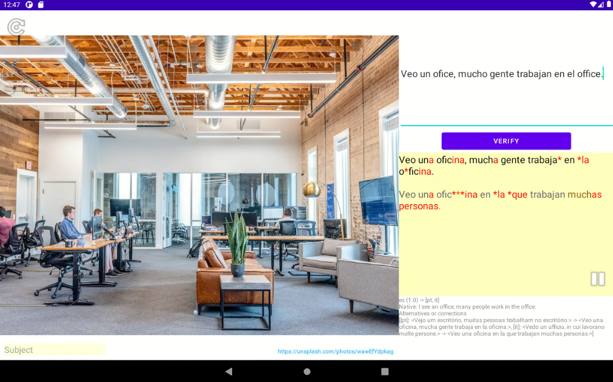

# Babel Magic - Describe the Picture

App to get corrections on picture descriptions which the user writes in the language (s)he learns.


## Use case

* The user retrieves a random picture (possibly with a topic)
* The user describes the picture in the language (s)he is learning (the TARGET language)
* (S)he presses "verify" and the text is translated into another language, and then
  translated back. That way the user sometimes gets corrections, but sometimes
  alternatives (and sometimes nonsense).
  * For example: RUSSIAN -> POLISH -> RUSSIAN (because polish is related)
  * or SPANISH -> (PORTUGUESE,ITALIAN) -> SPANISH and the most matching one is selected
* Also, the user can get a translation in his own language (to verify the meaning)
* The app calls a text-to-speech service and reads the text in the target language,
  until the user presses Pause, enters a new text, or asks for a new random picture.

# Architecture

## Services in a deployment diagram


## Sequence diagram


# Demonstration

## German


### Animation


## Spanish



### Animation


# Building
# The file `local.properties`

The program needs a `local.properties` file with URL's for azure

The contents should look like this:

```
# FOR AZURE
azure.service.api.url=<YOUR URL HERE>
azure.service.api.key=<YOUR KEY HERE>
azure.service.text.key=<YOUR KEY HERE>
azure.service.fk.key=<YOUR KEY HERE>
azure.service.tts.function.key=<YOUR KEY HERE>
azure.service.initialize.function.key=<YOUR KEY HERE>
version.code.without.encryption=<YOUR KEY HERE>

azure.service.unittest.key=<YOUR KEY HERE>
```

